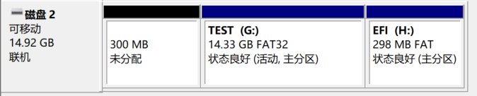

# PE系统的制作方法

## 准备材料

* 8GB以上**空**U盘一个
* 一台可以正常使用的Windows系统电脑

## 制作方法

### 1. 下载微PE工具箱

点击访问--> [微PE工具箱](http://www.wepe.com.cn/download.html)

出现如下界面：

**搬运地址(点击即可访问网盘链接)：**
+ [Win10PE_64bit](https://pan.baidu.com/s/1mi8vV6o)
+ [Win10PE_32bit](https://pan.baidu.com/s/1gePQWnh)
+ [Win8PE_64bit](https://pan.baidu.com/s/1bp1Glv5)
+ [Win8PE_32bit](https://pan.baidu.com/s/1gfyQlW3)

> 注：一般情况就选64位的，不要选32位  
> 只要电脑不是特别老，默认选择<code>win10PE</code>内核的版本，即V2.0  
> 综合考虑：大多数情况选择 <code>Win10PE_64bit</code>,若出现不兼容现象，<code>Win8PE_64bit</code>作为备选。

**下载方式：**  
官方给出的网址是百度网盘分享文件的链接，在电脑上下载可能需要安装客户端。限速问题，请自行充会员解决。

下载后的文件如下：  

### 2. 制作过程

双击运行下载好的<code>WePE_64_V2.0</code>或<code>WePE_64_V1.2</code>，出现如下界面：  

>  不要点击“立即安装进系统”，如果不慎点击，请卸载  
> 其他安装方式说明：  
> 1.安装PE到U盘(会格式化整个U盘)  
> 2.安装PE到移动硬盘(**危险操作：** 会把整个移动硬盘格式化！！！)  
> 3.生成可启动ISO(大神可选，小白慎选)

然后插入U盘(之前已经插入的不需要拔了)，点击安装PE到U盘(第一个图标)  

+ 安装方法 就选择默认，不要进行更改
+ 待写入U盘，选择你准备好的U盘（可根据盘符和容量进行确认）
    - 注：此时如果更换U盘，点击后边的按钮可以刷新，之后就可以看到更换后的U盘啦  
+ 格式化，将<code>exFAT</code>换成<code>FAT32</code>——<code>USB-HDD</code>保持不变
+ U盘卷标，就是制作后U盘的名字，根据自己喜好进行修改，默认亦可
+ 壁纸及其他选项可选

按照以上设置后，如下：  

再次确认：
+ 选择的是你准备好的U盘
+ U盘内文件已经备份

确认无误后，点击“立即安装进U盘”

稍等片刻即可安装成功！

制作完成后，U盘被分成好几个区，不必理会，EFI分区不要动，在最大的那个分区中可以放入数据

----
编写教程不易，能不能打赏一点资金，1块钱也行哦，直接扫码进行打赏（凭自愿）

